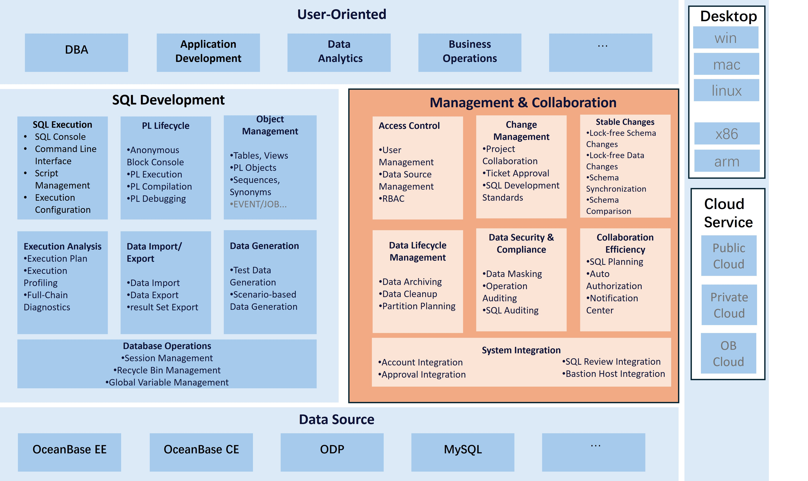
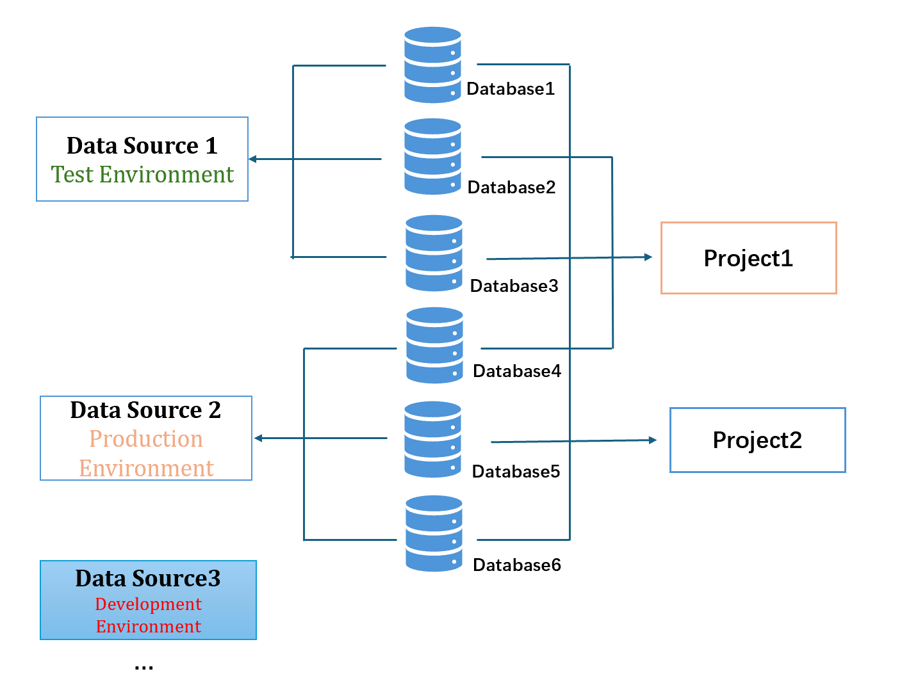

---
title: Use ODC for GUI-based SQL development
weight: 3
---

# 6.2 Use ODC for GUI-based SQL development

## About ODC

OceanBase Developer Center (ODC) is a GUI-based development tool and a collaborative management platform for data development and production change.

### Features and architecture

## Limitations

## Limitations on data source versions

|    Supported data source     |         Supported version         |
| --------------------------- | ------------------------- |
| OceanBase Database in MySQL mode | OceanBase Database Community Edition    |
| OB Sharding MySQL           | OceanBase Database Proxy (ODP) V3.2.8 and later |
| MySQL                       | MySQL 5.7                 |
| Oracle                      | Oracle 11g                |
| Doris                       | Doris 2.0.0 and later  |

For more information about limitations on ODC, see [Limitations](https://en.oceanbase.com/docs/common-odc-10000000001510644).

## Deployment

ODC is provided in two forms: Client ODC and Web ODC. Web ODC supports single-node deployment and high availability (HA) deployment. We recommend that you use Web ODC.

### Web ODC

Web ODC allows you to work in Individual Workspace mode or Team Workspace mode. Individual Workspace is suitable for individual developers and allows you to use features of Client ODC in a browser. You can access and create data sources as needed and develop databases with various windows and tools provided on the platform. Team Workspace is ideal for developers and database administrators (DBAs) to collaborate with each other. It is both a development tool and a collaborative management platform. ODC provides a variety of database development and management features, such as project collaboration, stable change, data security, and hot/cold data separation.

#### Single-node deployment

For more information about the single-node deployment mode of Web ODC, see [Deploy ODC on a single node](https://en.oceanbase.com/docs/common-odc-10000000001198207).

#### HA deployment

For more information about the HA deployment mode of Web ODC, see [Deploy ODC in high-availability mode](https://en.oceanbase.com/docs/common-odc-10000000001198205).

#### Check the deployment

After Web ODC is deployed, you can use the IP address and port number, for example, `<http://IP:PORT>` or `<http://DOMAIN:PORT>`, of the host (where the NGINX proxy resides in HA deployment) to access Web ODC in a browser.

After you log on to Web ODC, the homepage appears. If you are logging on to Web ODC for the first time, register an account and then log on. If you can create a connection and operate the database normally in ODC, it indicates that Web ODC is deployed successfully.

### Client ODC

Client ODC focuses on database development. It is lightweight and easy to deploy on Windows, macOS, and Linux. While functioning as a tool platform, Web ODC also provides collaborative management features to ensure the security, compliance, and efficiency of database changes. For more information about the deployment method, see [Install Client ODC](https://en.oceanbase.com/docs/common-odc-10000000001510683).

## Use ODC for SQL development

### Data sources

A data source is a remote database environment, such as a standalone OceanBase cluster or an instance of another database system.

#### Configure a data source

* ODC supports the following types of data sources: OceanBase Database in MySQL and Oracle mode, OceanBase Cloud in MySQL and Oracle mode, OB Sharding MySQL, and MySQL.

* You must specify the following parameters when you configure a data source:

  * Host IP address: the IP address or domain name of the data source.

  * Port: the port number of the data source.

  * Database username: the username of a database user for accessing the database.

  * Database password: the password of the database user.

* The following parameters are exclusive to OceanBase Database: cluster name and tenant name.

* If the data source is OceanBase-Cloud, cluster name and tenant name are not required, and the host IP address must be the domain name of the data source.

* The **Environment** parameter specifies the environment type of the data source, such as a development environment or production environment, to configure different control policies.

#### Use ODC

Manage databases

* Path: Click **Data Source** in the left-side navigation pane. On the page that appears, click the name of the target data source, and go to the **Database** tab.

* You can perform the following operations on the tab:
  
  * Create a database
  
  * Assign a database to a project

Manage the sessions of a data source

* Path: Click **Data Source** in the left-side navigation pane. On the page that appears, click the name of the target data source, and go to the **Session** tab.

* You can perform the following operations on the tab:

  * View all sessions in the data source.

  * End a session.

  * End an ongoing query in a session.

Use the recycle bin

* Path: Click **Data Source** in the left-side navigation pane. On the page that appears, click the name of the target data source, and go to the **Recycle Bin** tab.

* You can perform the following operations on the tab:

  * Restore deleted database objects, such as tables and views.

  * Purge the recycle bin or delete an object in the recycle bin.

> **Notice**
>
> The recycle bin is a tenant-level feature. Enable it with caution.

Use the command-line window

* Path: Click **Data Source** in the left-side navigation pane. On the page that appears, click the name of the target data source, and go to the **Command-line Window** tab.

* You can perform the following operations on the tab: Connect to the data source by using OceanBase Client (OBClient).

### SQL development

#### Edit and execute SQL statements

* Statement highlighting and formatting

  * Keywords are highlighted for you to catch key information at a glance.

  * SQL formatting:

    * The code is formatted based on the syntax, making the SQL statements pleasingly organized.

    * The code is expanded based on the syntax, making the SQL structure clear and easy to understand.

    Before formatting

    

    After formatting

    

* Syntax prompts

  * ODC supports keyword prompts to minimize spelling errors.

    

  * ODC supports database object prompts. This allows you to quickly find the target from numerous database objects.

    

  * ODC supports column name prompts based on the table that you are dealing with.

    

* SQL check

  * A number of rules are provided for comprehensive check.

  * The rules are derived from the best O&M practices of OceanBase Database, and are thus highly practical.

  * You can easily perform a check with a few clicks.

  * Risk levels are intelligently labeled to help you avoid risks.

  Built-in check rules:
  
  
  
  Perform an SQL check:
  
  

* SQL scripts

  * Code snippets

    * Snippets of frequently used statements, such as loop control and branch control statements, are saved.

    * You can drag a snippet to the SQL editing area. The operation is easy and fast, saving you from memorizing all the SQL or PL statements.
  
    

  * SQL scripts

    * Frequently used SQL scripts, such as anonymous blocks and query logic, are saved.

    * You can use the saved scripts for efficient queries.

    

#### Result sets

* Result set display modes
  
  * Data can be displayed in row mode for you to have a global view.

    

  * Data can be displayed in column mode for you to focus on details.

    
  
  * Large object (LOB) data can be displayed in texts, hexadecimal values, or images.

    

* Edit and export the result set

  * Edit the result set

    * Edit the selected row.

    * The modification methods vary with the data types.

    * You can modify multiple rows and then submit the modified result set.

  * Export the result set

    * Export SQL execution results. You can export SQL execution results to files of the following formats: CSV, EXCEL, and SQL.
  
    * Multiple encoding formats are supported.

  

#### SQL execution details and plans

* Execution duration statistics
  
  * ODC provides statistics on the execution duration of each SQL statement.
  
  * ODC allows you to view the time of each SQL execution phase.
  
  * ODC allows you to view the execution duration in the kernel without using SQL Audit.
  
  * The trace ID of each SQL statement is recorded for easier troubleshooting.
  
  

* Execution details

  * ODC displays the execution details of each SQL statement, such as the trace ID, execution duration, and execution plan.

  * ODC displays the entire execution process of an SQL statement, from the driver to OceanBase Database Proxy (ODP) and OBServer node, making end-to-end diagnostics possible.

  
  

#### Database objects

ODC allows you to manage all database objects supported by OceanBase Database, such as tables, views, functions, stored procedures, sequences, packages, triggers, and synonyms. For more information about GUI-based management of objects, see [Database objects](https://en.oceanbase.com/docs/common-odc-10000000001510832).

For more information about SQL development, see [SQL Development](https://en.oceanbase.com/docs/common-odc-10000000001510625).
